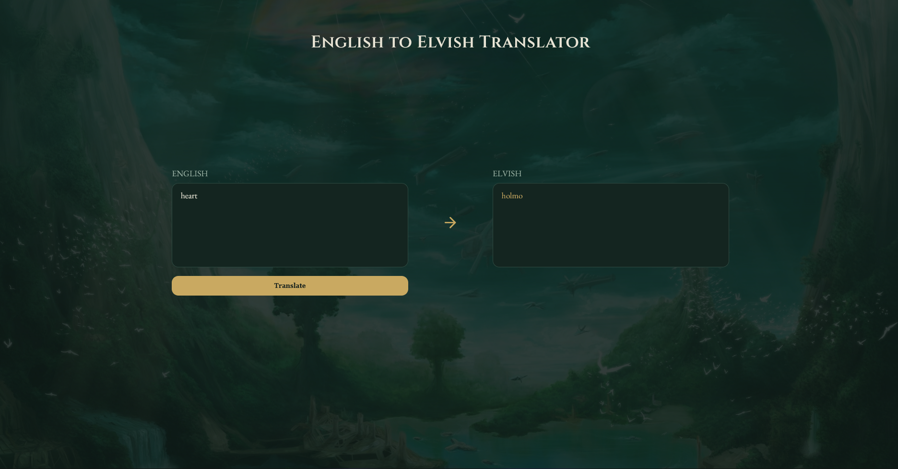
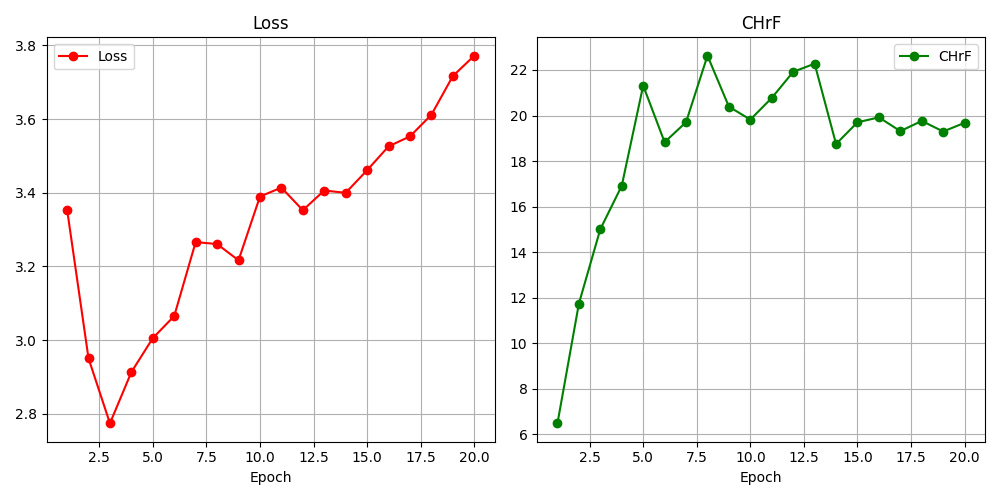

# English to Elvish Translator

A novice NLP project that translates English words and sentences into Elvish precisely Quenya — the artificial
language created by J.R.R. Tolkien for his *Lord of the Rings* series.

The model is a fine-tuned [Helsinki-NLP English to Finnish model](https://huggingface.co/Helsinki-NLP/opus-mt-en-fi),
trained on 10266 word pairs (9186 used for training, 1080 for evaluation) extracted from the [Eldamo](https://eldamo.org) lexicon.

The translator can be used in two ways: from the command line, or through a web page.



## Project structure

```
ELF-language-translator/
├── config.py              paths and training hyperparameters
├── train_model.py         fine-tunes the base model and saves it
├── model_using.py         loads the model, translates text (CLI)
├── Translator/            data parsing, dataset and metrics
├── Site/                  web application
│   ├── app.py             Flask server
│   ├── templates/         HTML
│   └── static/            CSS and JavaScript
└── data/                  Eldamo XML and the extracted dictionary
```

## Setup

1. Clone this repository.

   ```
   git clone https://github.com/majkab8/ELF-language-translator.git
   ```

2. Install the required packages.

   ```
   pip install -r requirements.txt
   ```

3. Optional — if you have an NVIDIA graphics card, replace the CPU build of PyTorch
   with the CUDA one. Training on a GPU is dramatically faster.

   ```
   pip uninstall -y torch
   pip install torch --index-url https://download.pytorch.org/whl/cu126
   ```

   Make sure this goes into the same environment as the other packages. If `train_model.py`
   prints `Using device: cpu`, the CUDA build did not land where Python is looking.

## Training

```
python train_model.py
```

The script parses the Eldamo XML into a CSV (skipped if the CSV already exists), fine-tunes the
model, and saves it to the directory set by `OUTPUT_DIR` in `config.py`. It also prints a table of
evaluation metrics per epoch and writes `training_results.png`.

Training must be run before either of the steps below — the model directory is not part of
this repository.

## Training results

The dataset is split so that all entries sharing an English word — case variants and synonyms
alike — stay on the same side of the split. The model is therefore evaluated on words it has
never seen, which makes the two rows below measure very different things.

| | Exact matches | chrF | CER |
|---|---|---|---|
| Words from the lexicon | 68.2% | 79.2 | 0.17 |
| Words outside the lexicon | 5.8% | 16.9 | 0.75 |

*Measured on 400 random samples from each side of the split.*

The first row is what the translator does in practice: for a word present in the Eldamo lexicon
it returns the correct Elvish form roughly two times out of three.

The second row is low by the nature of the task. No rule derives the Quenya word for *castle*
from other entries — the mapping has to be memorised, not inferred. What the model does learn is
the shape of the language: asked for an unknown word it answers with a real, phonetically
plausible Quenya form rather than nonsense, which is why chrF lands near 17 instead of zero.



The rising evaluation loss reflects the same thing. As the model memorises the lexicon it grows
more confident about entries it knows and correspondingly worse on ones it cannot know, so for
this task the curve is expected rather than a sign of a training problem.

## Using the translator

### Command line

```
python model_using.py
```

Type a word or sentence to translate, or `q` to quit. A single translation can also be passed
as an argument:

```
python model_using.py --text "the king of the forest"
```

### Web page

Run from the project root:

```
python -m Site.app
```

Wait for the model to load, then open `http://127.0.0.1:5000`.

## Notes

- The model translates word by word, so longer sentences take proportionally longer.
- The training data contains only nouns, verbs, adjectives and adverbs, so articles and prepositions are not translated — the model is a dictionary, not a grammar.
- Only English to Elvish is supported. The reverse direction, and other source languages,
  would each require a separately trained model.
